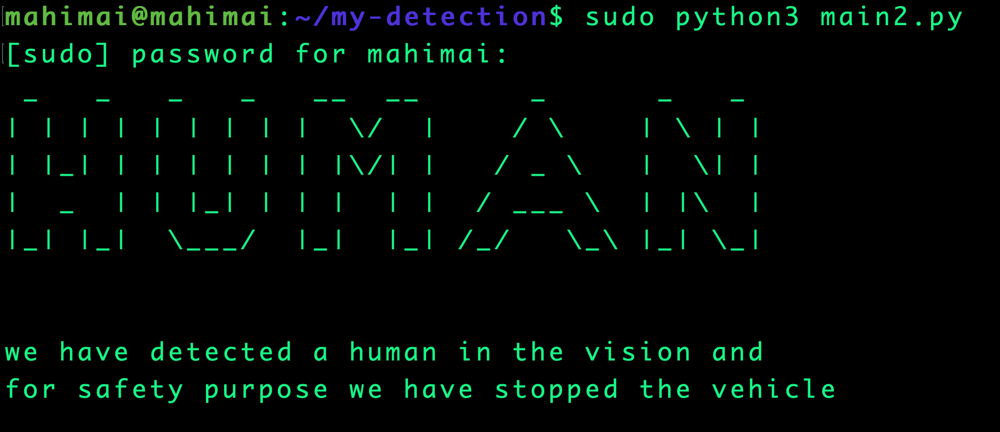
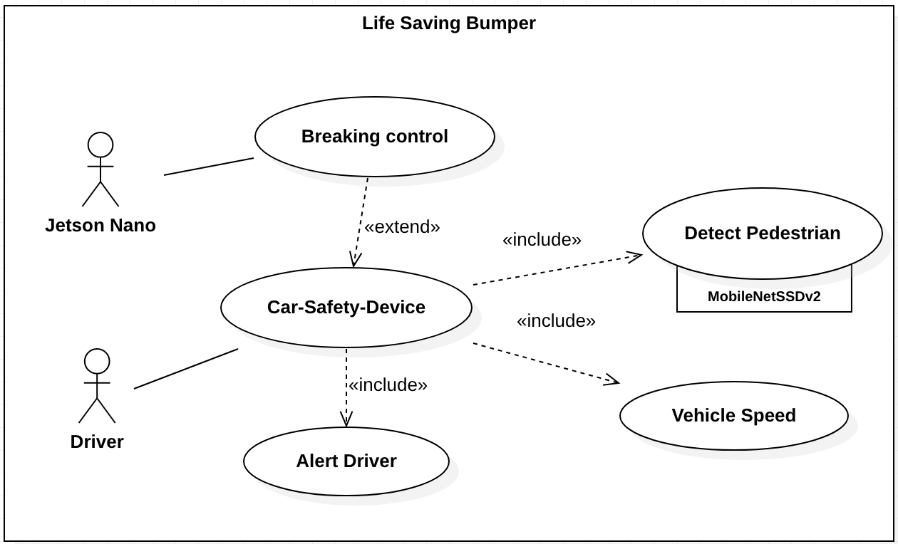

# Pedestrian Safety device with Computer Vision 

<h3> Here I have implemented object detection using Mobile Net version 2 SSD model </h3>

 

## Output in Jetson Nano :

## Detection cam window :

## Use Case Diagram :

## Use Case Diagram :

## System modules :

# Project Outcome :

- From the project I made me fluent to work with edge computing devices and connect them through ssh and vnc. 
- I learned to program in headless environment. 
- I upgraded my knowledge on Linux.
- Gained knowledge with IoT modules and sensors.
